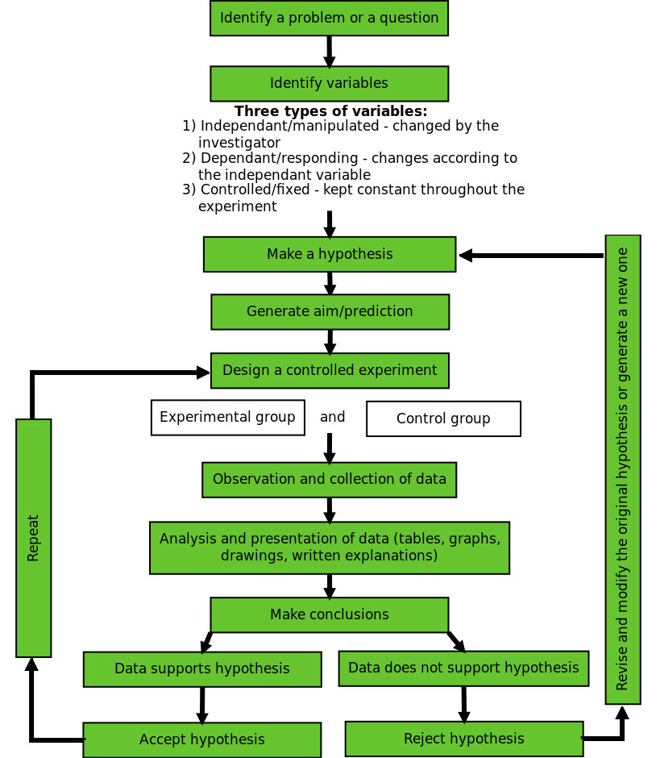

### CHAPTER

1

# Introduction to Life Sciences

  1.1 About this chapter - 4  
  1.2 What is Life Sciences? - 4  
  1.3 Why study Life Sciences? - 4  
1.4 How science works  
6  
  1.5 Biological drawings and diagrams - 12  
  1.6 Tables - 14  
  1.7 How to draw graphs in Science - 15  
  1.8 Mathematical skills in Life Sciences - 20  
  1.9 Lab safety procedures - 21

---

# 1.1 About this chapter

#### DUMMY

The aim of this chapter is to provide you with an overview of the skills that you develop as you learn to become a Life Scientist. Living systems exhibit levels of organisation from molecules to biomes. In addition, all life on earth is dynamic, with various processes main- taining equilibrium at every level of organisation. The life forms we observe today are a result of billions of years of change.

In this chapter you will learn how we gather evidence using the scientific method in order to form theories to explain what we observe. The scientific method requires us to constantly re- examine our understanding, by testing new evidence with our current theories and making changes to those theories if the evidence does not meet the test. The scientific method therefore is the powerful tool you will use throughout the Physical and Life Sciences.

# 1.2 What is Life Sciences?

#### DUMMY

Life Sciences is the scientific study of living things from molecular level to the ecosystem level, and involves a study of the interactions of organic molecules to the interactions of animals and plants with their environment. The list below contains some of the various branches of Life Sciences.

- Anatomy (plant and animal)
- Biochemistry
- Biotechnology
- Botany
- Ecology
- Entomology
- Environmental Studies
- Genetics
- Medicine
- Microbiology
- Morphology
- Physiology (plant and animal)
- Sociobiology (animal behaviour)
- Taxonomy
- Zoology

# 1.3 Why study Life Sciences?

#### DUMMY

Here are some reasons to study Life Sciences:

---

- To increase knowledge of key biological concepts, processes, systems and theories.
- To develop the ability to critically evaluate and debate scientific issues and processes.
- To develop scientific skills and ways of thinking scientifically that enables you to see the flaws in pseudo-science in popular media.
- To provide useful knowledge and skills that are needed in everyday living.
- To create a greater awareness of the ways in which biotechnology and knowledge of Life Sciences has benefited humankind.
- To show the ways in which humans have impacted negatively on the environment and organisms living in the environment.
- To develop a deep appreciation of the unique diversity of biomes In Southern Africa, both past and present, and the importance of conservation.
- To create an awareness of what it means to be a responsible citizen in terms of the environment and life-style choices that they make.
- To create an awareness of the contributions of South African scientists.
- To expose you to the range and scope of biological studies to stimulate interest in and create awareness of possible specialities and fields of study.
- To provide sufficient background for further studies and careers in one or more of the biological sub-disciplines.

# An A to Z of possible careers in Life Sciences

#### DUMMY

Ever wondered what you can do with Life Sciences after school? Below are some careers which you could study:

- Agronomist: someone who works to improve the quality and production of crops.
- Animal scientist: a researcher in selecting, breeding, feeding and managing of domes- tic animals, such as cows, sheep and pigs.
- Biochemist: someone who investigates the chemical composition and behaviour of the molecules that make up living things and uses this knowledge to try understand the causes of diseases and find cures.
- Botanist: someone who studies plants and their interaction with the environment.
- Developmental biologist: studies the development of an animal from the fertilised egg through to birth.
- Ecologist: a person who looks at the relationships between organisms and their envi- ronment.
- Food Scientist: someone who studies the biological, chemical and physical nature of food to ensure it is safely produced, preserved and stored, and they also investigate how to make food more nutritious and flavourful.
- Geneticist: a researcher who studies inheritance and conducts experiments to inves- tigate the causes and possible cures of inherited genetic disorders and how traits are passed on from one generation to the next.
- Horticulturalist: a person who works in orchards and with garden plants and they aim to improve growing and culturing methods for home owners, communities and public areas.
- Marine biologist: a researcher who studies the relationships between plants and ani- mals in the ocean and how they function and develop. They also investigate ways to minimise human impact on the ocean and its effects, such as over fishing and pollu- tion.

---

- Medical doctor or nurse: someone who uses the current latest understanding of the causes and treatments for disease to treat people who are ill or improve a person’s well-being.
- Medical illustrator: someone who illustrates and draws parts of the human body to be used in textbooks, publications and presentations.
- Microbiologist: a researcher who studies microscopic organisms such as bacteria, viruses, algae and yeast and investigates how these organisms affect animals and plants.
- Nutritionist: someone who gives advice to individuals or groups on good nutritional practices to either maintain or improve their health and to live a healthy lifestyle.
- Palaeontologist: a researcher who studies fossils of plants and animals to trace and reconstruct evolution, prehistoric environments and past life.
- Pharmacologist: a scientist who develops new or improved drugs or medicines and conducts experiments to test the effects of drugs and any undesirable side effects.
- Physiologist: a researcher who studies the internal functions animals and plants during normal and abnormal conditions.
- Science teacher: someone who helps students in different areas of science, whether it is at primary school, high school or university.
- Science writer: someone who writes and reports about scientific issues, new discover- ies or researcher, or health concerns for newspapers, magazines, books, television and radio.
- Veterinarian: someone who looks after the health and wellbeing of pets, domestic animals, animals in game parks and zoos.
- Zoologist: a researcher who studies the behaviour, interactions, origins and life pro- cesses of different animal groups.

# 1.4 How science works

#### DUMMY

Science investigation and research requires many skills and processes to come together in order to be successful and worthwhile.

- To be accepted as a science, certain methods for broadening existing knowledge, or discovering new things, are generally used.
- These methods must be repeatable and follow a logical approach.
- The methods include formulating hypotheses and carrying out investigations and ex- periments to test the hypothesis.
- Crucial skills are making objective observations, taking measurements, collecting in- formation and presenting the results in the form of drawings, written explanations, tables and graphs.
- A scientist must learn to identify patterns and relationships in data.
- It is very important to then communicate these findings to the public in the form of scientific publications, at conferences, in articles or TV or radio programmes.

Scientific method [DUMMY](http://www.everythingscience.co.za/@@emas.search?SearchableText=DUMMY)

The scientific method is the basic skill process in the world of science. Since the beginning of time humans have been curious as to why and how things happen in the world around us. The scientific method provides scientists with a well structured scientific platform to help find the answers to their questions. Using the scientific method there are very few things we

---

can’t investigate. Recording and writing up an investigation is an integral part of the scientific method.

A step-by-step guide to the scientific method

1. The question

Scientists are curious people, and most investigations arise from a scientist noticing some- thing that they don’t understand. Therefore the first step to any scientific investigation is:

- Ask a question to which you want to find an answer.

- What is happening?
- How is it happening?
- When is it occurring?
- Why is it happening?

- Example: A farmer notices that his tomato plants that are shaded have smaller tomatoes than his plants that are in a sunny spot, which makes him wonder: ’Does the amount of sunlight a tomato plant receives affect the size of tomatoes?’

---

Figure 1.1: Overview of scientific method.

2. Introduction

Once you have a general question, background research needs to be undertaken. Your background research will ensure that you are not investigating something that has already been researched and answered. It will also tell you about interesting connections, theories, explanations and methods that people have used in the past to answer questions related to yours. Science always builds on the work of others, and it ensures that our theories are constantly improved and refined. It is important to acknowledge the work of the people upon whose work your theory relies in the form of referencing. It is also vital to communicate your findings so that future scientists can use use your work as a basis for future research.

3. Identify variables

Your background research will help you identify the factors that influence your question. Factors that might change during the experiment are called variables.

---

- Firstly think of all the relevant variables you can change.
- Secondly think of all the variables you can measure or observe.

Different types of variables are given special names. Below is a list of some important variable types:

- The dependent variable is the thing that you want to measure or investigate.
- The independent variable is a factor (or factors) that changes which will have an effect on the dependent variable.
- In every experiment you need to know which independent variable you are testing, and keep all the other possible variables constant. We call the the variables we keep constant fixed variables, or controlled variables

Example: In this investigation, variables might include: the amount of sunshine, the types of soil in which the tomatoes are growing, the water available to each of the plants, etc. To which variable type does each factor belong?

- Dependent variable is the one you measure to get the results, e.g. the mass of tomatoes
- Independent variable is the ONE thing you vary to see how it affects the dependent variable, e.g. how much light the tomatoes are exposed to (dark / dim light or shade / bright light)
- Fixed/ Controlled variables are kept the same in all trials under investigation, because they may interfere with the results. All tomato plants will:

- Be the same species of tomato
- Get the same fertiliser (type and amount)
- Grow in the same type of soil
- Grow in the same type of container
- Get the same amount of water
- Can you think of more?

4. Hypothesis

Write down a statement or prediction as to what you think will be the outcome or result of your investigation. This is your hypothesis. The hypothesis should:

- be specific
- relate directly to the question you are asking
- be expressed as a statement that includes the variables involved (the ‘cause’ and ‘ef- fect’)
- be testable
- not expressed as a question but rather as a prediction
- be written in the future tense

Example: During your background research you would have learnt that tomatoes need sun- shine to make food through photosynthesis. You may predict that plants that get more sun will make more food and grow bigger. In this case your hypothesis would be: I think that the more sunlight a tomato plant receives, the larger the tomatoes will grow’.

---

NOTE:  
A scientific investigation does not aim to prove a particular event occurs or a particular rela- tionship exists. Rather, an investigation shows that it cannot disprove a particular suggestion or prediction. Therefore, it is important to note that an incorrect prediction does not mean that you have failed. It means that the experiment has brought some new facts to light that you might not have thought of before. Therefore even if your hypothesis (prediction) turns out to be wrong, DO NOT go back and change the hypothesis!

To test the hypothesis in life Sciences, you can follow the step-by-step guide which is outlined below.

5. Aim

- In the aim you need to state what you going to be investigating.
- Key words you can use are:

- To determine...
- To show that...
- To investigate...
- To find out...
- To observe...
- To measure...

Example: In this case, your aim would be: to investigate the effect of different amounts of sunlight on tomatoes.

NOTE:  
In science we never ‘prove’ a hypothesis through a single experiment because there is a chance that you made an error somewhere along the way, or there may be an alternate explanation for the results that you observe. What you can say is that your results SUPPORT the original hypothesis.

6. Apparatus  
All the apparatus that you will need for the investigation needs to be listed.

- Sizes of beakers, test tubes and measuring cylinders
- Specialised equipment that you may need must also be included (make sure that this equipment is available for your research).
- Include all chemicals and quantities that are required for your investigation.

7. Method

The next step is to test your hypothesis. An experiment is a tool that you design to find out if your ideas about your question are right or wrong. You must design an experiment that accurately tests your hypothesis. The experiment is the most important part of the scientific method. We will discuss independent and dependent variables as well as controls later. These are all important concepts to know when designing an experiment. In science, another researcher may want to repeat your method, to verify your results, improve it or do a variation of your experiment. Listing the apparatus helps others to verify that you used a suitable method, and enables them to replicate the experiment.

- Write down the scientific method in bullet format for your investigation.

---

- The method should be written so that a complete stranger will be able to carry out the same procedure in the exact same way and get almost identical results.
- The method should be written in the past tense using the passive voice.
- The method must be clear and precise instructions including
- the apparatus
- exact measurements or quantities of chemicals or substances
- Ensure that your method is written out in the correct sequence, with each step of the experiment numbered.
- State the criteria you will look for or measure to get results.
- Give clear instructions how the results should be recorded (table, graph etc.)
- Include safety precautions where possible.

8. Results

- Record your observations from doing the investigation.
- It is important that you do not write out an explanation for the results.
- Present your results in a suitable format such as tables and graphs.
- It is also important to note that not getting the result you expected is still a result. Even if there is no change at all, this is still a result that needs to be recorded.

9. Analysis of results or Discussion

- The analysis of the results is stating in words what the results are often saying in ta- bles/graphs.
- Discuss if there are there any relationships between your independent and dependent variables.
- It is important to look for patterns/trends in your graphs or tables and describe these clearly in words.

10. Evaluation of results

- This is where you answer the question “What do the results mean?”
- You need to carefully consider the results :
- Were there any unusual results? If so then these should be discussed and possible reasons for them can be given.
- Discuss how you ensured the validity and reliability of the investigation.  
∗ Vailidity: Was it a fair test and did it test what it set out to test?  
∗ Reliability: If the experiment were to be repeated would the results obtained be similar?
- The best way to ensure reliability is to repeat the experiment several times and obtain an average.
- Discuss any experimental errors that may have occurred during the experiment. These can include errors in the methods and apparatus used and what make suggestions what could be done differently next time.

11. Conclusion

The conclusion needs to link the results to the aim and hypothesis. In a short paragraph, write down if what was observed is supported or rejected by the hypothesis by restating the

---

variables that were tested. If your original hypothesis does not match up with the final results of your experiment, do not change the hypothesis. Instead, try and explain what might have been wrong with your original hypothesis. What information did you not have originally that cause you to be wrong in your prediction.

- Example: after conducting your experiment you may have found that tomato plants that received more sunlight grew larger than tomato plants grown in the shade or without light. Therefore you might conclude your investigation with the following:

- It was clear that tomato plants form bigger tomatoes when they are exposed to bright sunlight. The original hypothesis was supported.

# Important principles and relationships in Life Sciences

#### DUMMY

Surface area and volume

Depending on the system it is advantageous to either have a large surface to volume ratio or a small surface to volume ratio

This is highlighted in the following examples:

- Flatworms and leeches have more surface area to volume to increase the area for diffusion for nutrients and respiratory gases across their whole bodies.
- In animals the shapes of organs are defined by surface area to volume requirements. For example, in the lungs there are many branches to increase the surface area through which gases can be exchanged.
- Cells with a greater volume compared to surface area are able to metabolise more and ingest and excrete more through the membrane.

Structure and function

In living organisms, the structure of a particular biological feature is related to what function it performs. Thus for all the structures you will study in Life Sciences, the important questions to ask are the following:

1. What makes this structure suited to its function?
2. How has the structure adapted to its function?
3. Why is this structure so efficient for its function?

# 1.5 Biological drawings and diagrams

#### DUMMY

Drawings and diagrams are an essential part of communication in science, and especially Life Sciences. Remember it is not an artwork or sketch! But rather it is a clear representation of what you observe which can be used to interpret what you saw.

Some rules to follow Drawings and diagrams must:

