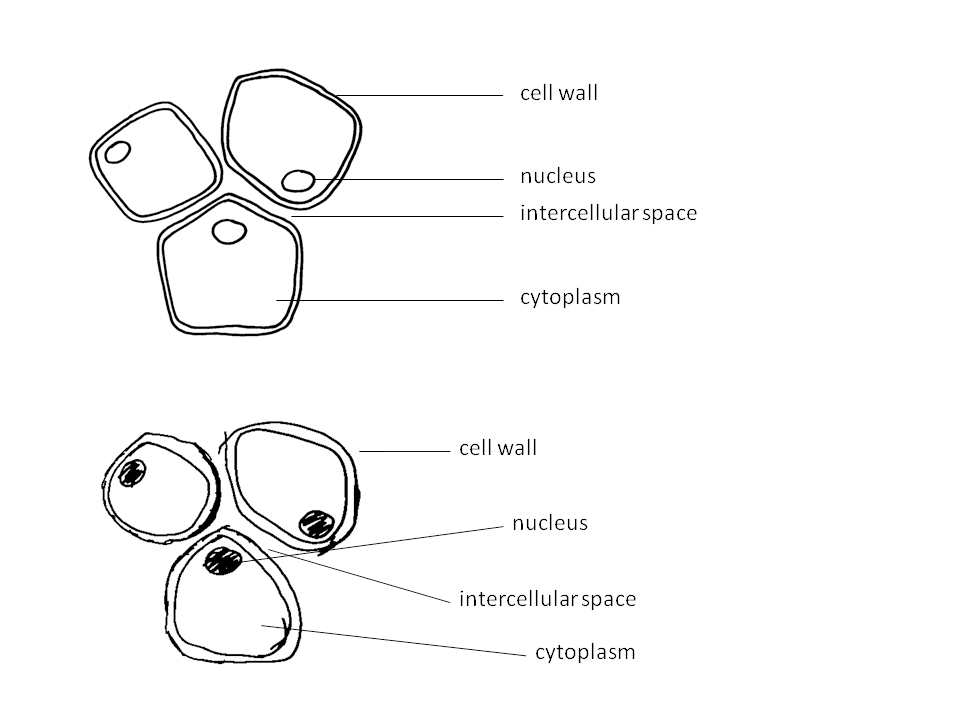
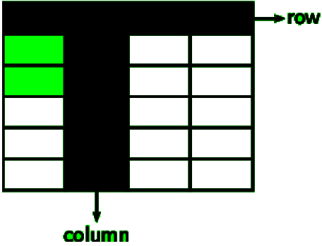
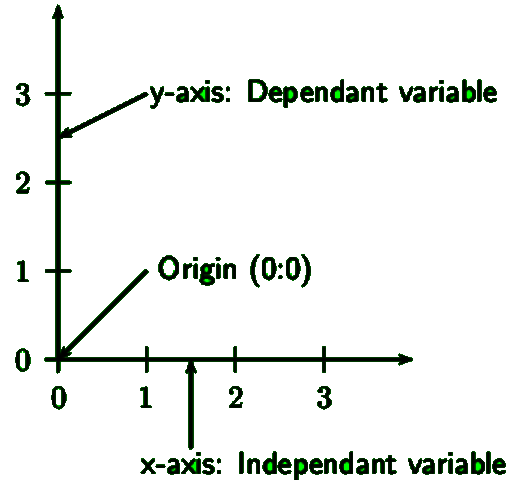
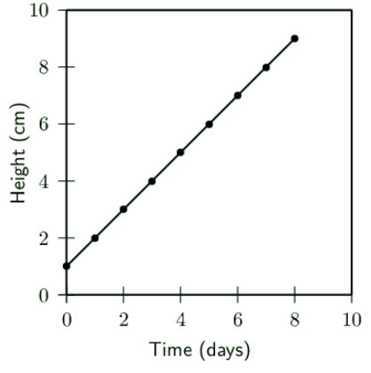
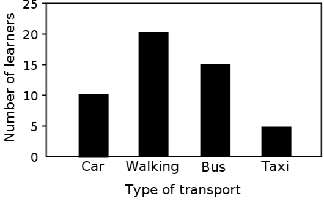
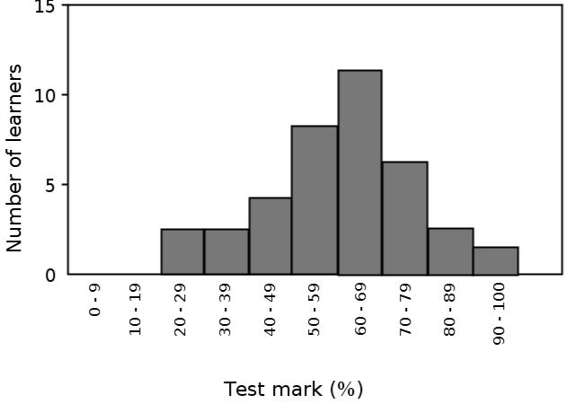
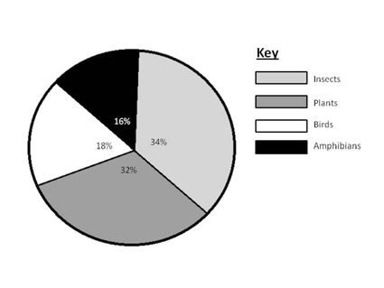
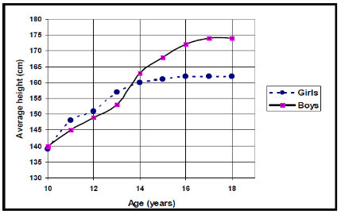
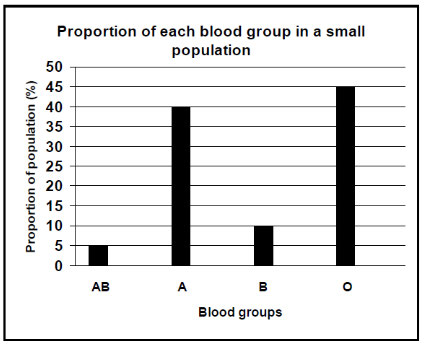

- Be drawn in a sharp pencil for clear, smooth lines.
- Be large so that all structures can be clearly seen (at least 10 lines of paper).
- Be drawn in the middle of the page.
- Be two dimensional (no shading)!
- Have a heading or caption.
- Specify the section in which the specimen was sliced, i.e. transverse section (T/S), cross section (C/S), or longitudinal section (L/S).
- State the source of the drawing or diagram, i.e. From a biological specimen, a micro- graph or a slide.
- Indicate the magnification or scale of the drawing, either in the caption or in the corner of the drawing.
- Label lines should be drawn and they must:
- be parallel to the top of the page and drawn with a ruler.
- not cross each other or have an arrow at the end.
- clearly indicate the structure which is being named.
- be aligned neatly, one below the other and preferably on one side of the page, unless there are many labels in which both sides can be used.

Activity: Identifying the key aspects of producing biological drawings Instructions:  
Make a list of what makes the above drawings good and bad.

Figure 1.2: Identify the features of the images that make each one good or bad.

Chapter 1. Introduction to Life Sciences  
13

---

Two-dimensional (2-D) and three-dimensional (3-D) diagrams [DUMMY](http://www.everythingscience.co.za/@@emas.search?SearchableText=DUMMY)

Objects in Life Science can be drawn in three dimensions because they have depth.

Diagrams of apparatus are generally drawn in two-dimensions so that the shape of each item of apparatus is simplified and looks similar to a section through the apparatus.

1.6 Tables [DUMMY](http://www.everythingscience.co.za/@@emas.search?SearchableText=DUMMY)

What is a table?

- A table is a summary of data, using as few words as possible.
- It is a grid divided up into rows and columns.
- The heading is placed above the table.
- The heading should include both variables under investigation- the dependent and independent variables.
- Independent variable is placed in the first column.
- The column headings should mention the units that were used, eg. grams, hours, km/hr, cm.

When to use a table?

- To summarise information.
- To compare related things or aspects.
- To record the results of an experiment.
- To illustrate patterns and trends.
- To record the data which will be used to construct a graph.

14 1.6. Tables

---

# 1.7 How to draw graphs in Science

### DUMMY

Presenting data graphically

Line Graphs  
Line graphs are used when:

- The relationship between the dependent and independent variables is continuous.
- Both dependent and independent variables are measured in numbers.

Features of line graphs:

- An appropriate scale is used for each axis so that the plotted points use most of the axis/space (work out the range of the data and the highest and lowest points).
- The scale must remain the SAME along the entire axis and use easy intervals such as 10’s, 20’s, 50’s, and not intervals such as 7’s, 14’s, etc, which make it difficult to read information off the graph.
- Each axis must be labelled with what is shown on the axis and must include the appropriate units in brackets, e.g. Temperature ( ◦ C), Time (days), Height (cm).
- Each point has an x and y co-ordinate and is plotted with a symbol which is big enough to see, e.g. a cross or circle.
- The points are then joined.
- With a ruler if the points lie in a straight line (see Figure 3) or you can draw a line of best fit where the number of points are distributed fairly evenly on each side of the line.
- Freehand when the points appear to be following a curve (see Figure 4).
- DO NOT start the line at the origin unless there is a data point for 0. If there is no reading for 0, then start the line at the first plotted point.
- The graph must have a clear, descriptive title which outlines the relationship between the dependent and independent variable.
- If there is more than one set of data drawn on a graph, a different symbol must be used for each set and a key or legend must define the symbols.

Chapter 1. Introduction to Life Sciences  
15

---

FACT  
Table headings are always written ABOVE the table. Graph headings are always written BELOW the graph.

Figure 1.3: Graph showing change in plant height over 10 days

Bar Graphs  
Bar graphs are used when:

- The independent variable is discontinuous (i.e. The variables on the x-axis are each associated with something different)
- Independent variables are not numerical. For example, when examining the protein content of various food types, the order of the food types along the horizontal axis is irrelevant.

Bar graphs have the following features:

- The data are plotted as columns or bars that do not touch each other as each deals with a different characteristic.
- The bars must be the same width and be the same distance apart from each other.
- A bar graph can be displayed vertically or horizontally.
- A bar graph must have a clear, descriptive title, which is written beneath the graph.

Figure 1.4: Bar graph showing how many learners use each type of transport Histograms

16

1.7. How to draw graphs in Science

---

Histograms are used when the independent variable (x-axis) represents information which is continuous, such as numerical ranges, i.e. 0-9, 10-19, 20-29, etc.

Histograms have the following features:

- Unlike a bar graph, in a histogram the data are plotted as columns or bars that touch each other as they are related to each other in some way.
- The numerical categories must not overlap, for example, 0-10, 10-20, 20-30, etc. The ranges must be exclusive so that there is no doubt as to where to put a reading, for example, 0-9, 10-19, 20-29, etc.
- The bars can be vertically or horizontally drawn.
- A histogram must have a descriptive heading with is written below the graph
- and the axes must be labelled.

Figure 1.5: A histogram showing the number of learners in a Grade 10 Life sciences class with a particular percentage test score

Pie charts [DUMMY](http://www.everythingscience.co.za/@@emas.search?SearchableText=DUMMY)

- You want to give a visual representation of percentages as a relative proportion of the total of a circle.
- They are a type of graph even though they do not have any axes.
- A pie chart is a circle divided into sectors (think of them as the slices of a cake).
- 100% represents the whole complete circle, 50% represents a half circle, 25% is a quarter circle, and so on.

Example:

1. Count the number of each species and record it in a table.
2. Work out the total number of species in the ecosystem.
3. Calculate the percentage of each species.
4. Use the following formula to work out the angle of each slice:

v × 360 ◦ a =  
t

Chapter 1. Introduction to Life Sciences  
17

---

| Species | No types of | % | Slice angle |  
|---|---|---|---|  
| Insects | 17 | 17 × 100 50 = 34% | 34 × 360 100 = 122,4 ◦ |  
| Plants | 16 | 16 × 100 50 = 32% | 16 × 360 100 = 115,2 ◦ |  
| Birds | 9 | 9 × 100 50 = 18% | 18 × 360 100 = 65 ◦ |  
| Amphibians | 8 | 8 × 100 50 = 16% | 16 × 360 100 = 57,6 ◦ |  

Table 1.1: Table showing recordings and calculations for construction of a pie chart

1. Use a compass to draw the circle and a protractor to measure accurate angles for each slice.

2. Start with the largest angle/percentage starting at 12 o’ clock and measure in a clock- wise direction.

3. Shade each slice and write the percentage on the slice and provide a key.

Figure 1.6: Pie chart showing the relative proportions of different categories of organisms in an ecosystem

Activity: Converting tables to graphs Reason:

18

1.7. How to draw graphs in Science

---

It is very important to be able to convert tables to graphs, and vice versa. Below are some exercises to practice this.

Questions:

1. Convert the data in the graphs below into Tables. Remember to identify which is the independent variable in the graphs and to place this in the first column of the Table.

Figure 1.7: The average height in boys and girls between the ages of 10 and 18 years.

Figure 1.8: Proportion of each blood group in a small population.

2. Convert the data in the following tables into graphs. Look back at the features of each type of graph to decide which one you will use.

Favourite take away restaurant in a class of learners

Take aways restaurant  
Learners (%) Kauai  
40  
Anat Falafel 15 Nandos  
25 Burger King 20

Chapter 1. Introduction to Life Sciences  
19

---

# 1.8 Mathematical skills in Life Sciences

### DUMMY

Mathematical skills are important in Life Sciences. Below are explanations of some of the skills you will encounter.  
NB. You must state the UNITS at the end of each calculation, e.g. cm, degrees, kg, etc. Scales  
A scale is given in a diagram, drawing or electron micrograph so that the actual size of the object that is being shown can be determined. The object could be bigger or smaller in real life.  
Example: To measure the diameter of a chloroplast with a scale line of 1 µm.

1. Measure the length of the scale line on the micrograph in mm, e.g. 1 µm = 17mm
2. Measure the diameter of the organelle in millimetres, e.g. = 60mm
3. True diameter of chloroplast:  
measured size × true length of scale line =  
measured length of scale line  
60 mm × 1 µm  
=  
17 mm  
= 3,53 µm

Averages  
To find an average of a set of numbers, you add all the items and divide the total by the number of items.  
Example: Find the average height in a class of 10 learners with the following heights in cm: 173, 135, 142, 167, 189, 140, 139, 164, 172, 181 cm.  
Total = 1602 (add all 10 heights together)  
Average  
1602  
Average =  
10  
= 160,2 cm

Percentages  
To calculate a percentage, multiply the fraction by 100.  
Formula for calculating percentage (%):  
Number with feature (A) Percentage = times100 Total number (B)

Example: Calculate the percentage of learners in your class that are left-handed.

20  
1.8. Mathematical skills in Life Sciences

---

1. Count how many learners are left handed (A).
2. Count the total number of learners in the class (B). There are 48 learners and 4 of them are left handed. Therefore, % of left-handed:

A  
= × 100 B  
4  
= × 100 48  
= 8,3%

8,3% of the learners in your class are left-handed. The percentage of right-handed learners:

= 100 − 8,3 = 91,7%

91,7% of the learners in your class are right-handed. Some conversions

| From unit: | To unit (number of these units per “From unit”): |<|<|<|  
|---|---|---|---|---|  
| m | mm | µm | nm |  
| m | 1 | 1000 | 1 000 000 | 1 000 000 000 |  
| mm | 10 −3 or 1/1000 | 1 | 1000 | 1 000 000 |  
| µm (micrometres) | 10 −6 or 1/1 000 000 | 10 −3 or 1/1000 | 1 | 1000 |  
| nm (nanometres) | 10 −9 or  1/1 000 000 000 | 10 −6 or 1/1 000 000 | 10 −3 or 1/1000 | 1 |  

# 1.9 Lab safety procedures

### DUMMY

The Life Science Laboratory has rules that are enforced as a safety precaution. These rules are:

- Take care when pouring liquids or powders from one container to another. When spillages occur you need to call the teacher immediately to assist in cleaning up the spillage.
- Take care when using acids. A good safety precaution is to have a solution of sodium bicarbonate in the vicinity to neutralise any spills as quickly as possible.
- Safety goggles and/ or gloves may need to be worn when doing experimental work, working with various chemicals, or heating substances, as spitting may occur.
- When lighting a Bunsen burner the correct procedure needs to be followed.
- Remember that when heating a substance in a test tube, the mouth of the test tube must face away from you and members in your group.

Chapter 1. Introduction to Life Sciences  
21

---

- Do not to overheat the solution when heating substances in a test tube.
- Ensure that you are dressed appropriately: hair should be tied back and loose clothing that could potentially knock over the equipment or catch alight if too near a flame should be avoided.
- Before doing any scientific experiment make sure that you know where the fire extin- guishers are in your laboratory and there should also be a bucket of sand to extinguish fires.
- If scalpel blades, pins and knives are used, take care not to cut yourself. If you do cut yourself and draw blood call the teacher immediately.
- When working with chemicals and gases that are hazardous a fume cupboard should be used.

22

1.9. Lab safety procedures

