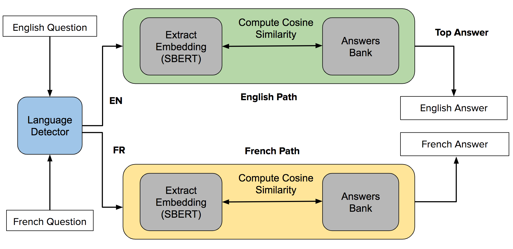
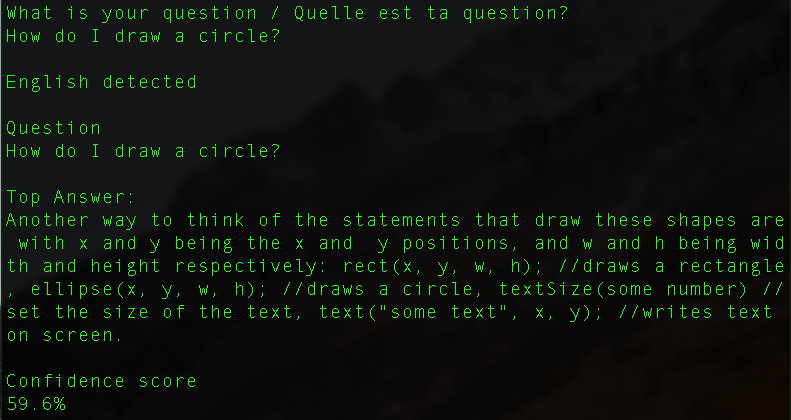
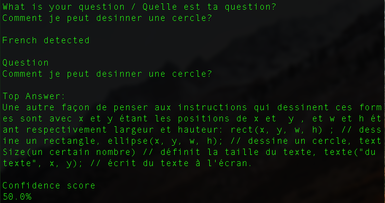

# KWAME: A BILINGUAL AI TEACHING ASSISTANT FOR ONLINE SUACODE COURSES

# George Boateng

ETH Zurich, Switzerland

ABSTRACT

1

Introductory hands-on courses such as our smartphone-based 2

coding course, SuaCode require a lot of support for students 0  
to accomplish learning goals. Online environments make it 2  
even more difficult to get assistance especially more recently n

because of COVID-19. Given the multilingual context of u  
SuaCode students — learners across 42 African countries J  
that are mostly Anglophone or Francophone — in this work, 4  
we developed a bilingual Artificial Intelligence (AI) Teach- 1  
ing Assistant (TA) — Kwame — that provides answers to students’ coding questions from SuaCode courses in English ]  
L  
and French. Kwame is a Sentence-BERT (SBERT)-based C  
question-answering (QA) system that we trained and eval- . s  
uated offline using question-answer pairs created from the c

course’s quizzes, lesson notes and students’ questions in [  
past cohorts. Kwame finds the paragraph most semantically 2

similar to the question via cosine similarity. We compared v

the system with TF-IDF and Universal Sentence Encoder. 7  
Our results showed that fine-tuning on the course data and 8  
returning the top 3 and 5 answers improved the accuracy re-

### 3 1

sults. Kwame will make it easy for students to get quick and 1 accurate answers to questions in SuaCode courses.

### 0 .

Index Terms— Virtual Teaching Assistant, Question

### 1 0

Answering, NLP, BERT, SBERT, Machine Learning, Deep

### 2 Learning

: v

##### X i

1. INTRODUCTION

r  
Introductory hands-on courses such as our smartphone-based a  
coding courses, SuaCode [1, [2,](#cite.boateng2019) 3] require a lot of support for students to accomplish learning goals (Figure 1). Offer- ing assistance becomes even more challenging in an online course environment which has become important recently be- cause of COVID-19 with students struggling to get answers to questions. Hence, offering quick and accurate answers could improve the learning experience of students. However, it is difficult to scale this support with humans when the class size ishuge—hundredsofthousands—sincestudentstendtoask questions whose answers could be found in course materials and also repetitively.  
There has been some work to develop virtual teaching assistants (TA) such as Jill Watson [4, 5], Rexy [6], and a physics course TA [7]. All of these TAs have focused on lo-

Fig. 1. Course forum with question answering example

gistical questions, and none have been developed and evalu- ated using coding courses in particular. Also, they have used one language (e.g. English).  
Given the multilingual context of our students — learn- ers across 42 African countries that are mostly Anglophone or Francophone — in this work, we developed a bilingual Artificial Intelligence (AI) TA — Kwame — that provides answers to students’ coding questions from our SuaCode courses in English and French. Kwame is named after Dr. Kwame Nkrumah the first President of Ghana and a Pan Africanist whose vision for a developed and empowered Africa resonates with the goals of our work. Kwame is a Sentence-BERT-based question-answering (QA) system that is trained using the SuaCode course material [8] and eval- uated offline using accuracy and time to provide answers. Kwame finds the paragraph most semantically similar to the question via cosine similarity. We compared Kwame with other approaches and performed a real-time implementation. Our work offers a unique solution for online learning, suited to the African context. Therestofthispaperisorganizedasfollows: InSection2, we talk about the background of SuaCode and related work. In Section 3, we describe Kwame’s system architecture and real-time implementation. In Section 4, we describe our data and preprocessing approach. In Section 5, we describe our experiments and evaluation. In Section 6 we present and dis- cuss the results. In Section 7, we describe the limitations of

---

this work and future work. We conclude in Section 8.

2. BACKGROUND AND RELATED WORK

In this section, we give the background of the SuaCode course and describe related work on virtual teaching assistants and the QA sentence selection task.

2.1. SuaCode Course

In 2017, we developed a smartphone-based coding course in Ghana, SuaCode, that enabled students to learn to code on their phones circumventing the need for computers [1]. We launched an online version of SuaCode in 2018 [2] and ex- panded it beyond Ghana to all Africans, dubbed SuaCode Africa in 2019 [3]. For our most recent cohort that run from June 2020 — SuaCode Africa 2.0, the course was offered in both English and French [9]. Over 2,300 students across 69 countries, 42 of which are in Africa applied. We accepted and trained 740 students [9]. Our long term vision is to lever- age smartphones to teach millions across Africa how to code. With our students needing a lot of assistance in their first cod- ing course ever, we have thus far relied on human facilitators to provide support and answer students’ questions. For exam- ple, in SuaCode Africa 2.0, facilitators contributed over 1,000 hours of assistance time for an 8-week period and helped to achieve an average response time of 6 minutes through the course. This approach is however not scalable as the number of students applying to SuaCode is increasing exponentially. An AI teaching assistant that provides accurate and quick an- swers to students’ questions would reduce the burden on hu- man teaching assistants, and provide an opportunity to scale learning without reducing the quality of education.

2.2. Virtual Teaching Assistants

The first work on virtual TAs was done by Professor Ashok Goel at the Georgia Institute of Technology in 2016. His team built Jill Watson, an IBM Watson-powered virtual TA to an- swer questions on course logistics in an online version of an Artificial Intelligence course for master’s students [4]. It used question-answer pairs from past course forums. Given a ques- tion, the system finds the closest related question and returns its answer if the confidence level is above a certain threshold. Since then, various versions of Jill Watson have been devel- oped to perform various functions: Jill Watson Q & A (revi- sion of the original Jill Watson) now answers questions using the class’ syllabi rather than QA pairs. Jill Watson SA gives personalized welcome messages to students when they intro- duce themselves in the course forum after joining and helps createonlinecommunities; AgentSmithaidstocreatecourse- specific Jills using the course’ syllabus [5]. Jill’s revision now uses a 2-step process. The first step uses commercial machine learning classifiers such as Watson and AutoML to classify a

sentence into general categories. Then the next step uses their own proprietary knowledge-based classifier to extract specific details and gives an answer from Jill’s knowledge base us- ing an ontological representation of the class syllabi which they developed. Also, the responses pass through a person- ality module that makes it sound more human-like. Jill has answered thousands of questions, in one online and various blended classes with over 4,000 students over the years. Similarworkhasbeendonebyotherresearcherswhobuilt a platform, Rexy for creating virtual TAs for various courses also built on top of IBM Watson [6]. The authors described Rexy, an application they built which can be used to build virtual teaching assistants for different courses and also pre- sented a preliminary evaluation of one such virtual teaching assistant in a user study. The system has a messaging com- ponent (such as Slack), an application layer for processing the request, a database for retrieving the answers, and an NLP componentthatisbuiltontopofIBMWatsonAssistantwhich is trained with question-answer pairs. They use intents (the task students want to be done) and entities (the context of the interaction). The intents (71 of those, e.g., exam date) are defined in Rexy but the entities have to be specified by instructors as they are course-specific. For each question, a confidence score is determined and if it is below a threshold, the question is sent to a human TA to answer and the answer is forwarded to the student. The authors implemented an ap- plication using Rexy and deployed it in an in-person course (about recommender systems) with 107 students. After the course, the authors reviewed the conversation log identified two areas of requests (1) course logistics (e.g., date and time of exams) and (2) course content (e.g. definitions and exam- ples about lecture topics).  
In the work by Zylich et al. [7], the authors developed a question-answering method based on neural networks whose goal was to answer logistical questions in an online introduc- tory physics course. Their approach entailed the retrieval of relevant text paragraphs from course materials using TF-IDF and extracting the answer from it using an RNN to answer 172 logistical questions from a past physics online course fo- rum. They also applied their system to answering 18 factual course questions using document retrieval without extracting an answer.  
These works do not focus on answering questions about the course content but rather, course logistics such as the for- mat for submitting assignments, goals of the course, etc. Our work will bridge that gap by focusing on providing answers to questions about course content like “how do I draw a circle at the center of my screen?”. Additionally, the technical de- tails of some of the systems and their evaluations both offline and online are not available (e.g. [4, [5,](#cite.goel2020) 6]) and hence they are not that easy to build upon and compare with. Our work provides these details along with our systematic evaluation to allow other researchers to replicate our work and also build upon it to create similar systems for their context. Also, all

---

the previous systems only work for one language (e.g. En- glish) whereas our system works for English and French. Ad- ditionally, none of those TAs have been developed for coding courses in particular. Coding courses have specific vocabu- lary which become more important when answers to content questions have to be provided. They pose unique challenges that need to be addressed to have systems that work well. Our work addresses these.

2.3. Question Answering: Answer Sentence Selection

Within the domain of question answering, there are two paradigms: Machine reading and sentence selection. Ma- chine reading entails selecting a span of text in a paragraph that directly answers the question. To extract the answer span, either the paragraph is provided (e.g., in the SQuAD question answering challenge [10]), or the relevant paragraph or set of paragraphs have to be retrieved from various documents first (e.g., as used in the physics QA system described in the previous section [7]). TF-IDF is mostly used for the para- graph(s) or document retrieval [11]. For answer extraction, RNNs have been used [7, [11]](#cite.chen2017) but BERT-based models are the current state-of-the-art [12].  
The task of answer sentence selection entails predicting which sentence among a group of sentences correctly answers a question. Two examples of public challenges within this do- main are the WikiQA and Natural Questions. The WikiQA dataset contains 3K questions from Bing queries with pos- sible answers selected from Wikipedia pages [13]. Natural Question contains 307K questions based on Google searches [14]. Various approaches have been used to tackle these chal- lengessuchasTF-IDFandunigramcount, andword2vecwith CNN [13] and BERT and RoBERTa [15]. BERT based mod- els are currently state-of-the-art for natural language process- ing tasks and they are used in our work.  
In this work, we use the answer sentence selection paradigm as opposed to the machine reading one. We do so because for our context of answering questions in online courses, especially content questions, short answers are gen- erally not adequate but rather, whole contexts that could span multiple continuous sentences. Hence, extracting an answer span is not necessary and could even be inadequate and more error-prone. This point is also made by Zylich et al. [7] after assessing the misclassifications in their evaluation using machine reading to answer physics course questions. We as a result focus on selecting and providing whole paragraphs as answers.

3. KWAME’S SYSTEM ARCHITECTURE

Kwame’s system model is Sentence-BERT (SBERT), a mod- ification of the BERT architecture with siamese and triplet network structures for generating sentence embeddings such that semantic similar sentences are close in vector space [16]

Fig. 2. System Architecture of Kwame

Fig. 3. Example of a real-time implementation of Kwame (English)

(Figure 2). The SBERT network was shown to outperform state-of-the-art sentence embedding methods such as BERT and Universal Sentence Encoder for semantic similarity tasks. We used the multilingual version [17].  
We also created a basic real-time implementation of Kwame using the SBERT model fine-tuned with the course data. A user types a question, Kwame detects the language automatically (using a language detection library) and then computes cosine similarity scores with a bank of answers (described next) corresponding to that language, retrieves, and displays the top answer along with a confidence score which represents the similarity score (Figure [3](#figure.3) and 4).

4. DATASET AND PREPROCESSING

We used the course materials from our “Introduction to Pro- gramming” SuaCode course written in English and French. Each document contains text organized by paragraphs that ex- plain concepts along with code examples, tables, and figures which were removed during preprocessing. Also, the course has multiple choice quizzes for each lesson and the answer to each question has a corresponding paragraph in the course material.  
In this work, we used lesson 1, “Basic Concepts in the Processing Language” to create 2 types of question-answer

---

Fig. 4. Example of a real-time implementation of Kwame (French)

similarity score. We then computed the accuracy of the pre- dictions and the average duration per question. We precom- puted and saved the embeddings to ensure the performance is quick. Evaluations were performed on a MacBook Pro with 2.9 GHz Dual-Core Intel Core i5 processor.  
In addition to this top 1 accuracy evaluation, we computed and compared top 3, and 5 accuracy results for the SBERT models similar to Zylich et al. [7]. To perform the evaluation, Kwame returns the top 3 or 5 answers and we check if the correct answer is any of those 3 or 5 answers.

6. RESULTS AND DISCUSSION

The duration and accuracy results are shown in Table [1.](#table.1) The duration results show that TF-IDF is the fastest method, fol- pairs (1) quiz-based (n=20) using the course’ quiz questions

lowed by SBERT regular, USE, SBERT trained, and SBERT and (2) student-based (n=12) using real-world questions from

fine-tuned taking the most time of 6 seconds which is not very students in past cohorts along with the corresponding para-

long nonetheless, compared to the average response time of 6 graph answers in the course materials. There were 39 para-

minutes in the recent SuaCode course (Table 1). These re- graphs and hence a random baseline of 2.6% for answer ac-

sults are consistent with the result of Rana [18] who found a curacy. similar trend.  
For the quiz data, TF-IDF has the worst performance of

5. EXPERIMENTS AND EVALUATION

We performed various experiments to evaluate the accuracy of our proposed models and the duration to provide answers. We used 3 models. The first model — SBERT (regular) — is the normal SBERT model which has already been fine-tuned on various semantic similarity tasks. Hence, it has no course- specific customization.  
For the second model — SBERT (trained) —, we trained the SBERT model using weakly-labeled triplet sentences from the course materials in a similar manner as Reimers et al. [16] to learn the semantics of the course’ text. For each paragraph, we used each sentence as an anchor, the next sentence after it in that paragraph as a positive example, and a random sentence in a random paragraph in the document as a negative example. We created a train-test split (75% : 25%) and trained the model using the triplet objective in Reimers et al. [16].  
For the third model, we explored fine-tuning the SBERT model separately using the quiz QA pairs — SBERT (fine- tuned with Quiz) — and student QA pairs — SBERT (fine- tuned with Student) — using the same triplet objective to en- able finding paragraphs that are semantically similar to ques- tions.  
We compared these models with TF-IDF and bi-grams as the baseline and Universal Sentence Encoder as a competitive alternative. The models were evaluated separately with the quiz and student QA pairs. To evaluate, we extracted each question’s embedding and then computed the cosine similar- ity between the question’s embedding and all the possible an- swers’ embeddings, and returned the answer with the biggest

30% and 45% for English and French respectively (but bet- ter than the random baseline of 2.6%) with USE and SBERT (Regular) having better performance.  
Our SBERT model that we trained using the weakly- labeled data from the course materials did not perform better than SBERT regular. This result might suggest that using weakly-labeled data with the triplet objective might not be adequate to improve the results. It could also be due to the small number of samples. Further exploration is needed.  
The SBERT models that were fine-tuned on the QA task had the highest accuracies as expected. Overall, the mod- els performed better for the quiz data than the student data. This result is expected since the quiz’s questions were created based on specific paragraphs in the text which served as an- swers. The students’ questions however were from the real- world and did not have specific answers used to create the question. Also, the questions were noisy with various phrases and sentences present which were not semantically related to the course text like “Any idea please?”, “Good day class” etc. This realization highlights some key challenges and points to a need to develop various approaches to automatically clean the text of real-world questions before performing the seman- tic search.  
A look at some of the questions that our models got wrong provided interesting insights. The model’s misclassi- fications sometimes happened when the model retrieved an answer that could either partially or completely also answer the question but was not the designated correct answer. In the real world, these answers by our model will be sufficient to address the questions of students. Our current evaluation approach assumes that there is only one answer and also that only one paragraph is needed to answer a question. Hence,

---

Table 1. Accuracy and Duration Results  
Table 2. Top 1, 3, and 5 Accuracy Results for SBERT

| Model | Accuracy (%) |<|<|<| Duration (secs per question) |<|  
|---|---|---|---|---|---|---|  
| English |<| French |<| English | French |  
| Quiz | Student | Quiz | Student |^|^||  
| TF-IDF (Baseline) | 30% | 16.7% | 45% | 8.3% | 0.03 | 0.02 |  
| Universal Sentence Encoder (USE) | 40% | 25% | 35% | 16.7% | 3.7 | 3.2 |  
| SBERT (regular) | 50% | 25% | 65% | 8.3% | 3.0 | 2.7 |  
| SBERT (trained) | 50% | 25% | 60% | 8.3% | 6.0 | 5.5 |  
| SBERT (fine-tuned with Quiz) | 65% | 16.7% | 70% | 8.3% | 6.0 | 6.0 |  
| SBERT (fine-tuned with Student) | 60% | 58.3% | 65% | 58.3% | 5.8 | 5.6 |  

| Model | Accuracy (%) |<|<|<|<|<|<|<|<|<|<|<|  
|---|---|---|---|---|---|---|---|---|---|---|---|---|  
| English |<|<|<|<|<| French |<|<|<|<|<|  
| Quiz |<|<| Student |<|<| Quiz |<|<| Student |<|<|  
| Top 1 | Top 3 | Top 5 | Top 1 | Top 3 | Top 5 | Top 1 | Top 3 | Top 5 | Top 1 | Top 3 | Top 5 |  
| SBERT (regular) | 50 | 75 | 75 | 25 | 50 | 75 | 65 | 75 | 75 | 8.3 | 50 | 75 |  
| SBERT (trained) | 50 | 75 | 75 | 25 | 33 | 91.7 | 60 | 75 | 75 | 8.3 | 58 | 75 |  
| SBERT (fine-tuned with Quiz) | 65 | 80 | 75 | 16.7 | 50 | 83.3 | 70 | 75 | 75 | 8.3 | 33 | 91.7 |  
| SBERT (fine-tuned with Student) | 60 | 80 | 85 | 58.3 | 83.3 | 100 | 65 | 80 | 80 | 58.3 | 91.7 | 91.7 |  

relaxing this assumption in future evaluations would improve the recognition results. Further investigation is also needed on the best way to combine partial answers in different para- graphs to provide one answer.

Computing top 3 and 5 accuracy is one step in that direc- tion exploring multiple answers. The results comparing the top 1, 3and 5 performance are shown in Table 2. Asexpected, the accuracy results improved for top 3 and top 5 even getting up to 100% with similar results for English and French ques- tions. These results suggest that returning top 3 or 5 answers would enable students get the correct answers they need. In a course setting, returning 3 answers, for example, should not be overwhelming hence worth exploring especially if it could improve Kwame’s real-world accuracy.

The closest work that we can compare our accuracy re- sults to is the work of Zylich et al. [7] that we described in the related work section. For their work, they attempted to cor- rectly answer 18 factual physics questions which are similar to our coding content questions (20 quiz type and 12 student type). Their document retrieval approach which is analogous to our QA system had 44.4%, 88.9% and 88.9% top 1, 3 and 5 accuracies respectively. Our best system had 58.3% (58.3%), 83.3% (80%) and 100% (91.7%) top 1, 3 and 5 accuracies for the student QA type for English (French). Hence, our results are overall slightly better than the work of Zylich et al. [7] Another work to compare with is by Rana [18]. They imple- mented an approach for semantic search to answer questions that individuals asked about a university, based on informa- tion on the university’s website. One of their approaches is similar to ours and it involved document retrieval and para- graph selection using BERT. Their approach achieved 56% accuracy. Our result of 58.3% is also slightly better.

7. LIMITATION AND FUTURE WORK

In this work, we did not evaluate Kwame in a real-world con- text of an online course. We will do this in the future and evaluate the real-world performance using a platform like Pi- azza which has been used extensively by Goel for real-word deployments [5]. The deployment would also entail Kwame returning figures as part of answers if the answer contains a reference to a figure in the lesson note. We will do the evalua- tion quantitatively (accuracy, upvotes or downvotes, response rate) and qualitatively (students’ feedback on Kwame). Additionally, we used a small sample of QA pairs and sentences in this work — only the text from the first lesson. Future work will use all lessons and compare performance across lessons. Also, we will explore various approaches that could potentially increase the accuracy and reduce the time to retrieve the answers by using tags as filters (e.g. \#lesson1) to retrieve only the possible answers whose tag(s) match the tag of the question before performing comparison via cosine similarity.  
Finally, the data and experiments in this work assume that all questions in the course are answerable by Kwame. Ideally, in a course, Kwame will not answer some questions if the confidence score is below a certain threshold. Further work is needed to detect and evaluate those cases.

8. CONCLUSION

In this work, we developed a bilingual AI TA — Kwame — to answer students’ questions from our online introductory coding course, SuaCode in English and French. Kwame is an SBERT-based question-answering (QA) system that we trained and evaluated using question-answer pairs created from the course’s quizzes and students’ questions in past co- horts. We compared the system to TF-IDF and Universal Sen-

---

tence Encoder. Our results showed that SBERT performed [8] “Suacode - smartphone-based cod- the worst for duration (6 secs per question) but the best for  
accuracy, and fine-tuning on our course data improved the  
result. Also, returning the top 3 and 5 answers improved the  
results. Nonetheless, key challenges remain such as having a  
higher accuracy for real-world questions.  
Our long-term vision is to leverage the power of AI to de-  
mocratize coding education across Africa using smartphones.  
Specifically, we aim to use AI to make learning more person-  
alized for our students through providing accurate and timely  
answers to questions in our courses currently in English and  
French and in the future, in various African languages such as  
Twi (Ghana), Yoruba (Nigeria), Swahili (Kenya, Tanzania),  
Zulu (South Africa). Kwame is an important part of achiev-  
ing this vision by making it easy for students to get quick and  
accurate answers to questions in our SuaCode courses.

9. ACKNOWLEDGEMENT  
We are grateful to Professor Elloitt Ash for his mentoring and Victor Kumbol for helpful discussions.

10. REFERENCES  
[1] George Boateng and Victor Kumbol, “Project iswest: Promoting a culture of innovation in africa through stem,” in 2018 IEEE Integrated STEM Education Con- ference (ISEC). IEEE, 2018, pp. 104–111.  
[2] George Boateng, Victor Wumbor-Apin Kumbol, and Prince Steven Annor, “Keep calm and code on your phone: A pilot of suacode, an online smartphone-based coding course,” in Proceedings of the 8th Computer Sci- ence Education Research Conference, 2019, pp. 9–14.

ing course,” [https://github.com/Suacode-](https://github.com/Suacode-) app/Suacode/blob/master/README.md.  
[9] “Suacode africa 2.0: Teaching coding online to africans using smartphones during covid-19,” [https://www.c4dhi.org/news/lecture-by-boateng-](https://www.c4dhi.org/news/lecture-by-boateng-) suacode-africa-20210122/.  
[10] Pranav Rajpurkar, Jian Zhang, Konstantin Lopyrev, and Percy Liang, “Squad: 100,000+ questions for machine comprehension of text,” arXiv preprint arXiv:1606.05250, 2016.  
[11] Danqi Chen, Adam Fisch, Jason Weston, and Antoine Bordes, “Reading wikipedia to answer open-domain questions,” arXiv preprint arXiv:1704.00051, 2017. [12] Jacob Devlin, Ming-Wei Chang, Kenton Lee, and Kristina Toutanova, “Bert: Pre-training of deep bidirec- tional transformers for language understanding,” arXiv preprint arXiv:1810.04805, 2018.  
[13] Yi Yang, Wen-tau Yih, and Christopher Meek, “Wikiqa: A challenge dataset for open-domain question answer- ing,” in Proceedings of the 2015 conference on empir- ical methods in natural language processing, 2015, pp. 2013–2018.  
[14] Tom Kwiatkowski, Jennimaria Palomaki, Olivia Red- field, Michael Collins, Ankur Parikh, Chris Alberti, Danielle Epstein, Illia Polosukhin, Jacob Devlin, Ken- ton Lee, et al., “Natural questions: a benchmark for question answering research,” Transactions of the Asso- ciation for Computational Linguistics, vol. 7, pp. 453– 466, 2019.  
[3] “Nsesa runs suacode africa — africa’s first [15] Siddhant Garg, Thuy Vu, and Alessandro Moschitti, smartphone-based online coding course,”  
“Tanda: Transfer and adapt pre-trained transformer [https://nsesafoundation.org/nsesa-runs-suacode-africa/.](https://nsesafoundation.org/nsesa-runs-suacode-africa/.)  
models for answer sentence selection,” arXiv preprint [4] Ashok K Goel and Lalith Polepeddi, “Jill watson: A  
virtual teaching assistant for online education,” Tech.  
Rep., Georgia Institute of Technology, 2016.  
[5] Ashok Goel, “Ai-powered learning: Making education  
accessible, affordable, and achievable,” arXiv preprint  
arXiv:2006.01908, 2020.  
[6] Luca Benedetto and Paolo Cremonesi, “Rexy, a con-  
figurable application for building virtual teaching assis-  
tants,” in IFIP Conference on Human-Computer Inter-  
action. Springer, 2019, pp. 233–241.  
[7] Brian Zylich, Adam Viola, Brokk Toggerson, Lara Al-  
Hariri, andAndrewLan, “Exploringautomatedquestion  
answering methods for teaching assistance,” in Inter-  
national Conference on Artificial Intelligence in Educa-  
tion. Springer, 2020, pp. 610–622.

arXiv:1911.04118, 2019.  
[16] Nils Reimers and Iryna Gurevych, “Sentence-bert: Sen- tence embeddings using siamese bert-networks,” arXiv preprint arXiv:1908.10084, 2019.  
[17] Nils Reimers and Iryna Gurevych, “Making mono- lingual sentence embeddings multilingual using knowl- edge distillation,” in Proceedings of the 2020 Confer- ence on Empirical Methods in Natural Language Pro- cessing. 11 2020, Association for Computational Lin- guistics.  
[18] Muhammad Rana, “Eaglebot: A chatbot based multi- tier question answering system for retrieving answers from heterogeneous sources using bert,” 2019.

